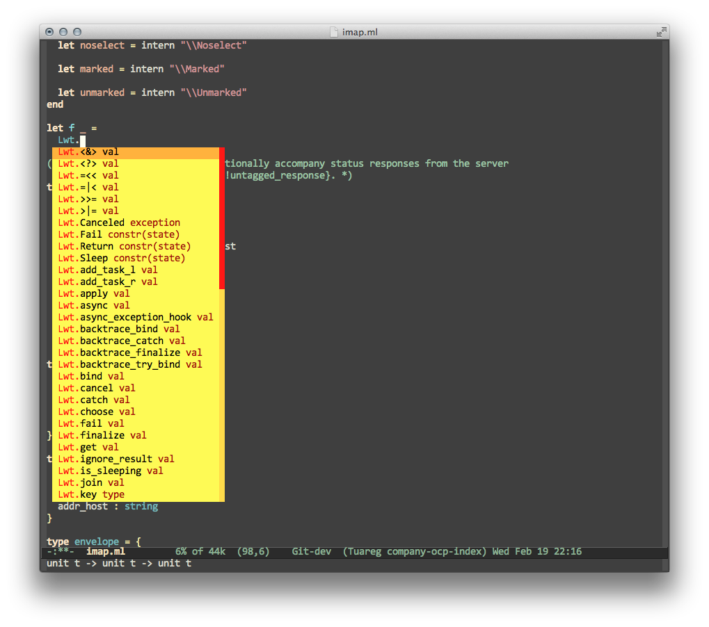

# company-ocp-index #

`company-ocp-index` is a [company-mode](http://company-mode.github.io) back-end
to complete [OCaml](http://caml.inria.fr) using
[ocp-index](https://github.com/OCamlPro/ocp-index).

### Screenshot ###



## Configuration ##

### Requirements ###

* [Emacs](http://www.gnu.org/software/emacs/)
* [company-mode](http://company-mode.github.io)
* [tuareg-mode](https://github.com/ocaml/tuareg)
* [ocp-index](https://github.com/OCamlPro/ocp-index)
* (OPTIONAL) [opam](http://opam.ocaml.org)

### Installation ###

1. Make sure that `company-mode` is working and that `ocp-index` is in your path.

2. Download and install `company-ocp-index.el`. Just clone the repository
and copy `company-ocp-index.el` somewhere in your disk. For example, if you would
like to keep it in `~/emacs.d/`, you can do:

    ```sh
    cd ~/tmp
    git clone https://github.com/nojb/company-ocp-index
    cp company-ocp-index/company-ocp-index.el ~/.emacs.d
    ```

3. Set up `company-ocp-index` to activate when editing OCaml files. You can do
this by copying the code below to your `.emacs.el` (or `init.el`, or whatever
you use to initialize your Emacs).  If the directory where you copied your file
is already in Emacs `load-path`, then you can skip the first line
below. Otherwise just replace `~/.emacs.d/` by whatever directory you copied
`company-ocp-index.el` to.

    ```elisp
    (add-to-list 'load-path "~/.emacs.d/")

    (require 'company-ocp-index)

    (defun enable-company-ocp-index ()
    (add-to-list (make-local-variable 'company-backends) 'company-ocp-index))

    (add-hook 'tuareg-mode-hook 'enable-company-ocp-index)
    (add-hook 'caml-mode-hook 'enable-company-ocp-index)
    ```

4. Enjoy!

## COPYING ##

This program is free software: you can redistribute it and/or modify
it under the terms of the GNU General Public License as published by
the Free Software Foundation, either version 3 of the License, or
(at your option) any later version.

This program is distributed in the hope that it will be useful,
but WITHOUT ANY WARRANTY; without even the implied warranty of
MERCHANTABILITY or FITNESS FOR A PARTICULAR PURPOSE.  See the
GNU General Public License for more details.

You should have received a copy of the GNU General Public License
along with this program.  If not, see [http://www.gnu.org/licenses/](http://www.gnu.org/licences/).
